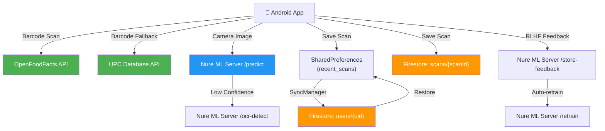

# Nure — Database & API Overview

---

## Databases Used

The app uses **two data stores** in parallel:

### 1. Firebase Cloud Firestore (Remote)
- **Project**: `nure-70d49`
- **Console**: `https://console.firebase.google.com/project/nure-70d49/firestore`
- Managed by: [FirebaseManager.java](file:///c:/Projects/Nure/app/src/main/java/com/example/healthscanner/database/FirebaseManager.java), [FirebaseScanManager.java](file:///c:/Projects/Nure/app/src/main/java/com/example/healthscanner/database/FirebaseScanManager.java)
- Auth: **Firebase Auth** (Email/Password + Google Sign-In)

### 2. Android SharedPreferences (Local)
- **File**: `HealthScannerPrefs`
- Managed by: individual activities + [SyncManager.java](file:///c:/Projects/Nure/app/src/main/java/com/example/healthscanner/database/SyncManager.java)
- Acts as the **primary local cache**; synced to Firestore periodically

---

## Firestore Collections & Document Schemas

### Collection: `users`
> Document ID = Firebase Auth UID

| Field | Type | Description |
|-------|------|-------------|
| `uid` | string | Firebase Auth user ID |
| `email` | string | User email |
| `displayName` | string | Display name |
| `photoUrl` | string | Profile photo URL |
| `authProvider` | string | `"password"`, `"google.com"` |
| `createdAt` | timestamp | Account creation date |
| `lastLoginAt` | timestamp | Last login time |
| `isEmailVerified` | boolean | Email verification status |
| **Health Statistics** | | |
| `totalScans` | number | Total products scanned |
| `healthyChoices` | number | Scans with score ≥ 70 |
| `averageHealthScore` | number | Average score (0-100) |
| `lastScanDate` | timestamp | Last scan time |
| `lastScanTimestamp` | number | Last scan epoch ms |
| **Preferences** | | |
| `notificationsEnabled` | boolean | Push notifications |
| `darkModeEnabled` | boolean | Dark mode |
| `preferredLanguage` | string | e.g. `"en"` |
| `healthConcerns` | array\<string\> | e.g. `["diabetes", "high blood pressure"]` |
| `dietaryPreferences` | array\<string\> | e.g. `["vegetarian", "keto"]` |
| **Profile** | | |
| `age` | number | User age |
| `gender` | string | User gender |
| `dietaryPreferences` | string | (also exists as single string field) |
| `healthGoals` | string | Free-text health goals |
| **Sync Metadata** | | |
| `scanHistory` | string | Full scan history as JSON string |
| `lastSyncTimestamp` | timestamp | Last sync time |
| `lastFullSyncTimestamp` | timestamp | Last full backup time |
| `backupTimestamp` | timestamp | Last backup time |
| `backupVersion` | string | e.g. `"1.0"` |
| `deviceInfo` | string | e.g. `"Pixel 8 14"` |
| `appVersion` | string | e.g. `"1.0.0"` |

#### Sub-collection: `users/{uid}/scans`
> Individual scan documents (saved via [FirebaseManager.saveScanHistory](file:///c:/Projects/Nure/app/src/main/java/com/example/healthscanner/database/FirebaseManager.java#L278-L306))

| Field | Type | Description |
|-------|------|-------------|
| `userId` | string | Owner user ID |
| `timestamp` | timestamp | Scan time |
| *(+ any fields from the scan data map)* | | |

---

### Collection: `scans`
> Top-level collection used by [FirebaseScanManager](file:///c:/Projects/Nure/app/src/main/java/com/example/healthscanner/database/FirebaseScanManager.java)
> Document ID = scan's `scanId`

| Field | Type | Description |
|-------|------|-------------|
| `scanId` | string | Unique ID (`scan_{timestamp}_{random}`) |
| `userId` | string | Owner user ID |
| `productName` | string | Product name |
| `barcode` | string | Product barcode |
| `category` | string | `"food"`, `"cosmetics"`, `"beverages"` |
| `subCategory` | string | `"snacks"`, `"skincare"`, etc. |
| `scanDate` | timestamp | When scanned |
| `healthScore` | number | 0-100 scale |
| `calories` | number | Calories per 100g |
| `brand` | string | Product brand |
| `imageUrl` | string | Product image URL |
| `isFavorite` | boolean | Favorited by user |
| **Nutrition** | | |
| `protein` | number | grams |
| `carbs` | number | grams |
| `fat` | number | grams |
| `sugar` | number | grams |
| `sodium` | number | milligrams |
| `fiber` | number | grams |
| **Health Analysis** | | |
| `healthGrade` | string | A, B, C, D, E |
| `healthConcerns` | array\<string\> | e.g. `["high_sugar"]` |
| `positiveAspects` | array\<string\> | e.g. `["high_fiber"]` |
| **Metadata** | | |
| `scanLocation` | string | GPS / location name |
| `scanDuration` | number | Scan time in ms |
| `scanMethod` | string | `"camera"`, `"manual_entry"`, `"gallery"` |

---

## SharedPreferences Keys (`HealthScannerPrefs`)

| Key | Type | Description |
|-----|------|-------------|
| `recent_scans` | JSON string (array) | Local scan history (max 50) |
| `health_concerns` | StringSet | User's health concerns |
| `dietary_preferences` | StringSet | Dietary preferences |
| `total_scans` | int | Total scan count |
| `healthy_choices` | int | Healthy choice count |
| `average_health_score` | float | Average health score |
| `current_user_email` | string | Logged-in user email |
| `current_user_name` | string | Display name |
| `current_user_id` | string | Firebase UID |
| `current_user_photo` | string | Photo URL |
| `auth_provider` | string | Auth provider |
| `login_timestamp` | long | Login epoch ms |
| `join_date_timestamp` | long | Registration epoch ms |
| `last_sync_timestamp` | long | Last Firebase sync epoch ms |
| `notifications_enabled` | boolean | Notifications pref |
| `dark_mode_enabled` | boolean | Dark mode pref |
| `is_first_launch_after_signin` | boolean | First launch flag |

---

## APIs Used

### A. Self-Hosted Backend (Nure ML Server)

> **Base URL**: `http://10.211.191.61:5000` — [ApiConfig.java](file:///c:/Projects/Nure/app/src/main/java/com/example/healthscanner/ApiConfig.java#L11)
> **Stack**: Flask + PyTorch (MobileNetV2)
> **Source**: [backend/app.py](file:///c:/Projects/Nure/backend/app.py)

| Endpoint | Method | Purpose | Status |
|----------|--------|---------|--------|
| `/predict` | POST | Food image recognition via ML model | ✅ Active |
| `/ocr-detect` | POST | OCR-based food text detection (fallback) | ✅ Active |
| `/store-feedback` | POST | RLHF — store human corrections | ✅ Active |
| `/retrain` | POST | RLHF — trigger model retraining | ✅ Active |
| `/model-stats` | GET | RLHF training statistics | ✅ Active |
| `/health` | GET | Server health check | ✅ Active |

---

### B. External Food/Nutrition APIs

> Managed by [ProductApiService.java](file:///c:/Projects/Nure/app/src/main/java/com/example/healthscanner/ProductApiService.java) with cascading fallback (tries each in priority order)

| API | Base URL | Auth | Status |
|-----|----------|------|--------|
| **OpenFoodFacts** | `https://world.openfoodfacts.org/api/v0/product/` | None (free) | ✅ **Active** — primary lookup |
| **UPC Database** | `https://api.upcitemdb.com/prod/trial/lookup` | None (trial) | ✅ **Active** — fallback #1 |
| **Nutritionix** | `https://trackapi.nutritionix.com/v2/search/item` | API key required | ⚠️ **Placeholder** — keys not configured |
| **Spoonacular** | `https://api.spoonacular.com/food/products/upc/` | API key required | ⚠️ **Placeholder** — keys not configured |
| **USDA FoodData Central** | `https://api.nal.usda.gov/fdc/v1/foods/search` | API key required | ⚠️ **Placeholder** — keys not configured |
| **Edamam** | `https://api.edamam.com/api/food-database/v2/parser` | API key required | ⚠️ **Placeholder** — keys not configured |

> [!NOTE]
> Only **OpenFoodFacts** and **UPC Database** are actually functional. The other 4 APIs have placeholder API keys (`"your_*_api_key"`) and are skipped at runtime via the `isConfigured()` checks in [ApiConfig.java](file:///c:/Projects/Nure/app/src/main/java/com/example/healthscanner/ApiConfig.java#L64-L81).

---

### C. Firebase Services

| Service | Purpose | Used By |
|---------|---------|---------|
| **Firebase Auth** | Email/password + Google Sign-In | [AuthManager.java](file:///c:/Projects/Nure/app/src/main/java/com/example/healthscanner/AuthManager.java) |
| **Cloud Firestore** | User profiles, scan data, preferences | [FirebaseManager.java](file:///c:/Projects/Nure/app/src/main/java/com/example/healthscanner/database/FirebaseManager.java), [FirebaseScanManager.java](file:///c:/Projects/Nure/app/src/main/java/com/example/healthscanner/database/FirebaseScanManager.java) |

---

## Data Flow Diagram

> [!WARNING]
> There is a **data duplication issue**: scans are stored in **3 places** simultaneously:
> 1. `SharedPreferences` → `recent_scans` (JSON array string)
> 2. `Firestore` → `users/{uid}` document (as `scanHistory` JSON string field)
> 3. `Firestore` → `users/{uid}/scans` sub-collection (individual documents)
> 
> The top-level `scans` collection ([FirebaseScanManager](file:///c:/Projects/Nure/app/src/main/java/com/example/healthscanner/database/FirebaseScanManager.java)) is a **4th location** but is only used for reading in AnalyticsActivity — no activity currently writes to it via `FirebaseScanManager.saveScan()`.
