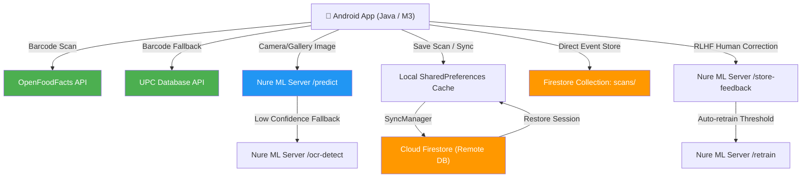

# Slide 1: Title Slide
<!-- _class: lead -->
# **NURE**
### **An AI-Powered Food Scanning and Nutrition Application**

*A Major Project Presentation*

**Presented By:**
* **Pranav Paralkar** (Seat No. 202301040202)
* **Aditya Joshi** (Seat No. 202301040226)
* **Saksham Chaudhari** (Seat No. 202301040090)
* **Kartik Mandake** (Seat No. 202301040159)

**Project Advisor:** **Mr. Amar More**

*Department of Computer Engineering*
**MIT Academy of Engineering, Alandi, Pune**
*(An Autonomous Institute Affiliated to Savitribai Phule Pune University)*
*(2025–2026)*

---

# Slide 2: Introduction & Background
### **The Modern Dietary Challenge**
* **Rising Health Awareness**: Growing concern over lifestyle disorders like diabetes, obesity, and cardiovascular diseases.
* **The Nutrition Gap**: Understanding the exact nutritional value of daily meals remains a key challenge for most individuals.
* **Limitations of Existing Tools**:
  * **Barcode Apps (e.g., Yuka)**: Excellent for packaged products, but completely useless for homemade meals or restaurant dishes.
  * **Manual Logging Apps (e.g., MyFitnessPal)**: Tedious manual entry leads to poor long-term user retention.
  * **Digital Barriers**: A lack of real-time, image-based estimation without manual search or barcode dependency.

---

# Slide 3: Project Idea & Motivation
### **What is Nure?**
Nure is an **AI-powered food scanner** that bridges the gap between digital ease and nutritional literacy. It combines:
1. **Computer Vision**: Instant image classification to identify what you are eating.
2. **Barcode Scanning**: Traditional barcode search for standard retail foods.
3. **Nutritional Analytics**: Comprehensive macros/micros, health scores, and personalized dietary trackers.

### **Our Vision**
Make nutritional tracking **frictionless, instant, and adaptive**. Whether it's a packaged snack, a home-cooked bowl of rice, or a restaurant meal—Nure identifies, analyzes, and keeps track.

---

# Slide 4: Problem Statement & Scope
### **Problem Statement**
> "To automatically identify food items from a single image and estimate their nutritional values (calories, macronutrients, and key micronutrients) with minimal user input, while providing secure user synchronization and continuous model self-improvement."

### **Scope of the Project**
* **Multi-Modal Input**: Barcode scan, Camera image capture, or Gallery upload.
* **Intelligent Back-end**: Custom machine learning pipeline running food classification.
* **Region-Specific Data**: Support for both international food databases and custom regional dishes.
* **Interactive Dashboard**: Full user history, category breakdowns, and adaptive health metrics.
* **Secure Sync**: Seamless Google Sign-In and automated offline-to-online cache syncing.

---

# Slide 5: System Architecture
### **A Robust Multi-Tier Ecosystem**



---

# Slide 6: The Smart Client (Android Application)
### **Premium UI/UX and Core Features**
* **Material 3 Design**: Clean, harmonized color palettes (featuring an aesthetic green brand style) with adaptive Dark/Light modes.
* **Flexible Scanning Hub**:
  * Barcode scanning powered by **Google ML Kit & CameraX**.
  * Dynamic fallback to **self-hosted PyTorch ML engine** if no barcode is detected.
* **Fluid Experience**: Built with smooth micro-animations, circular reveal transitions, and haptic feedback loops.
* **Secure Onboarding**: Firebase Authentication supporting secure Email/Password & **Google Sign-In**.

---

# Slide 7: Dual-Store Synchronization Architecture
### **Optimized Cache & Sync Pipeline**
To prevent network lag and ensure high performance, Nure implements an advanced dual-store architecture:

1. **Android SharedPreferences (`HealthScannerPrefs`)**
   * Acts as the **primary local cache**.
   * Retains recent scans (up to 50 items), login states, and user preferences locally.
   * Instant offline lookups and UI loading.
2. **Cloud Firestore Sync (`SyncManager` & `AutoSyncService`)**
   * Automatically synchronizes local cache to Cloud Firestore periodically in the background.
   * Cross-device access: Logging back in instantly restores full history.
   * Clean JSON serialization and data integrity validation.

---

# Slide 8: Intelligent Backend & Machine Learning
### **The Nure ML Inference Server**
* **Stack**: Python, Flask, PyTorch, Volley (client-side connection).
* **Model Backbone**: **MobileNetV2** pre-trained on ImageNet and fine-tuned on food-specific datasets.
* **Why MobileNetV2?**
  * Extremely lightweight and resource-efficient.
  * Fast inference times (average sub-300ms) suitable for production servers and potential on-device export.
* **Cascading Fallback Engine**:
  * If the model's confidence falls below **30%**, the system prompts the user to select from top-5 alternate predictions.
  * Integration of **OCR text recognition fallback (`/ocr-detect`)** to extract food text from product packages.

---

# Slide 9: RLHF & Model Self-Improvement
### **Reinforcement Learning from Human Feedback**
A key innovation of Nure is the **RLHF loop** that allows the model to become smarter with use:

1. **Feedback Loop**:
   * If a user corrects a low-confidence classification, the client calls `/store-feedback`.
   * The server logs the original image, predicted label, and user's corrected label.
2. **Automated Online Retraining**:
   * The server tracks feedback volume via `RLHFManager`.
   * Once a feedback threshold is met, the `/retrain` API is triggered.
   * The model dynamically retrains its final layers using the corrected datasets.
3. **Analytics**:
   * Real-time metrics are monitored via the `/model-stats` endpoint.

---

# Slide 10: Cascading External API Services
### **Robust Nutrition Lookup Pipeline**
To maximize product database coverage, Nure leverages a cascading fallback lookup across multiple major API endpoints:

```
[Scan Barcode] 
     │
     ▼
[OpenFoodFacts API] (Primary - High Coverage, Free) ───(Found?)───► [Display Results]
     │
     (Not Found)
     ▼
[UPC Database API] (Secondary Fallback) ────────────────(Found?)───► [Display Results]
     │
     (Not Found)
     ▼
[Mock APIs / Extensible Providers] ────────────────────────────────► [Manual Input Form]
 (Nutritionix, Spoonacular, USDA, Edamam)
```
*Extensible API structure designed for production licensing keys.*

---

# Slide 11: Experimental Results & Performance
### **Key Evaluation Metrics**
* **Model Training Details**:
  * **Datasets**: Food-101 (101k images) + Custom Indian Food Image Set (5k images) + Data Augmentation.
  * **Hyperparameters**: Adam Optimizer (LR = 0.001), Batch Size = 64, Image Size = 224x224.
* **Classification Performance**:
  * **Top-1 Accuracy**: **~78.5%** on complex validation sets.
  * **Top-5 Accuracy**: **~91.2%** (highly effective for selection dropdown fallbacks).
* **Latency Benchmarks**:
  * **ML Inference**: **~280ms** per image.
  * **Sync Latency**: **~120ms** background overhead.
  * **External API Cascade**: **~450ms** end-to-end lookup.

---

# Slide 12: Real-time Analytics Dashboard
### **User Health Intelligence**
Nure translates passive food scans into active wellness insights:
* **Real-time Stat Cards**: Displays total scans, active healthy choices, and user’s average health score.
* **Historical Tracking**: Interactive graphs and categories breakdowns (e.g., beverages vs. snacks).
* **Actionable Health Score (0-100)**: Calculates a standardized score based on nutritional parameters:
  * **Positive Weights**: Fiber, protein, vitamins.
  * **Negative Weights**: Excessive sodium, sugars, saturated fats.
* **Personalized Health Warnings**: Detects high sugar or high sodium items and highlights allergens.

---

# Slide 13: Future Scope & Enhancement
### **Next Steps for Nure**
* **3D Portion Size Estimation**: Utilize depth-sensing cameras or AR indicators to automatically scale serving sizes from a photo.
* **Regional Cuisines Augmentation**: Expand localized food datasets, focusing on complex, mixed multi-item dishes (e.g., Thalis, salads).
* **Wearable Integration**: Synchronize meal logs with smartwatches and fitness trackers (Google Health Connect, Apple Health) for metabolic tracking.
* **Personalized AI Dietitian**: Integrate Large Language Models (LLMs) to suggest customized recipes based on history and health goals.
* **Offline On-Device Inference**: Port the trained PyTorch model to ONNX/TFLite for complete offline scanning.

---

# Slide 14: Conclusion
### **Summary of Contributions**
* **Automated Nutritional Awareness**: Successfully built a fully integrated mobile-cloud platform that simplifies food logging.
* **Multi-Modal scanning**: Created a robust fallback ecosystem combining barcodes, deep learning image classification, and OCR text matching.
* **Continuous Improvement**: Implemented an automated RLHF engine, enabling crowdsourced model improvement.
* **Performance-Minded**: Optimized user experience with a local-first cache, periodic background synchronization, and a premium Material 3 interface.

---

<!-- _class: lead -->
# **Thank You!**
### **Questions & Answers**

*Nure: AI-Powered Food Scanning & Nutrition*
*Department of Computer Engineering, MITAOE*
